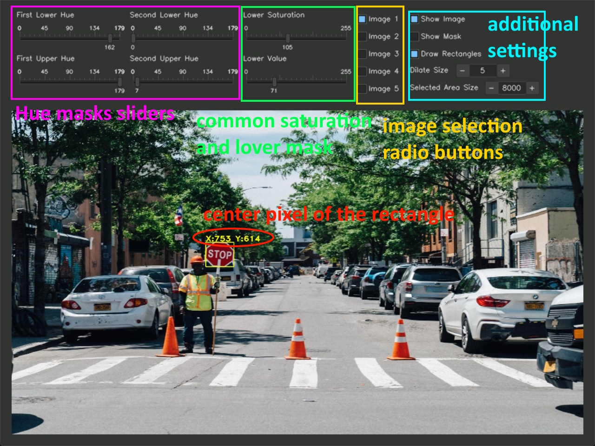
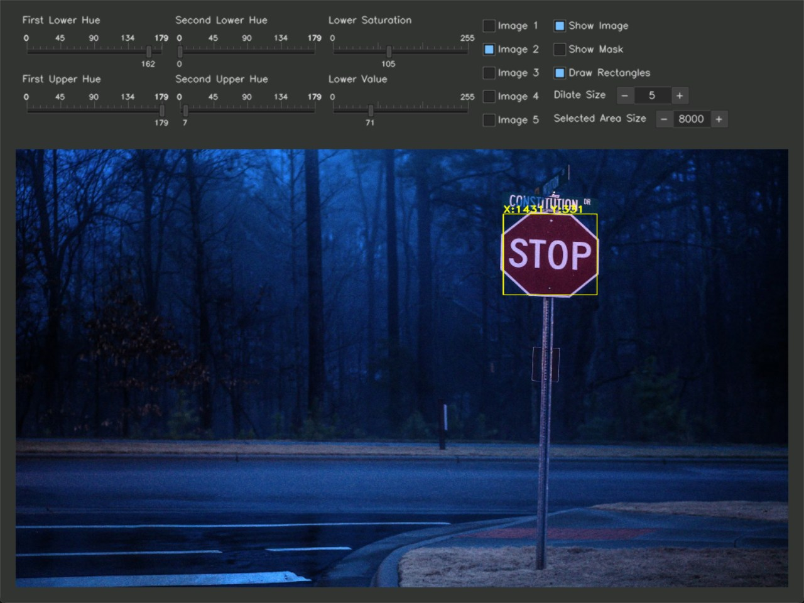
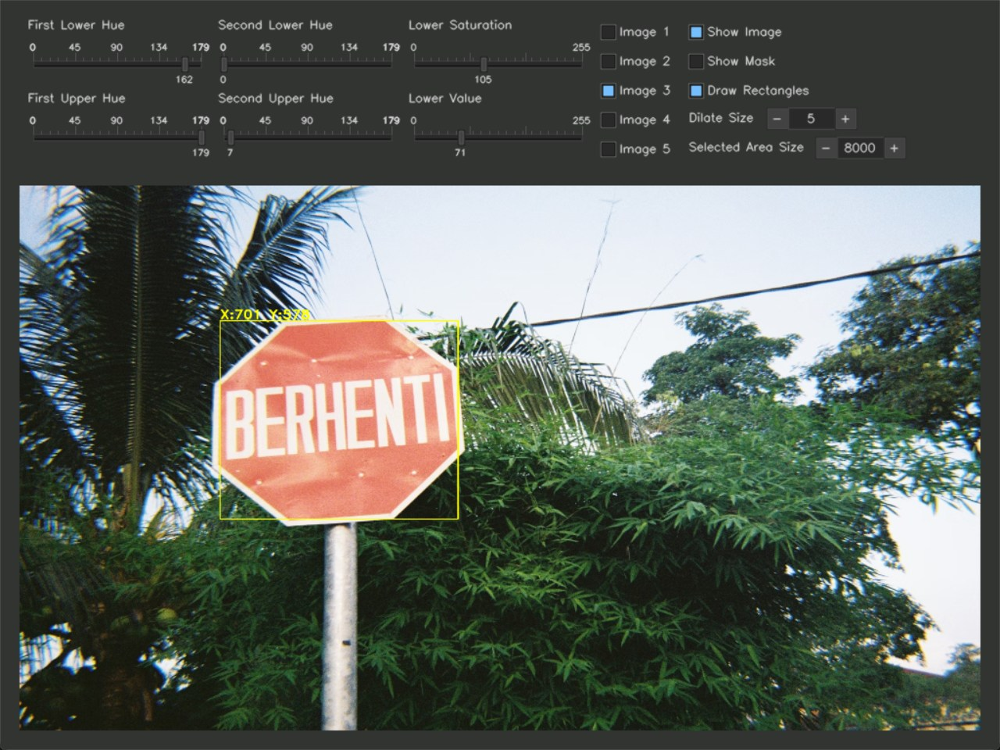
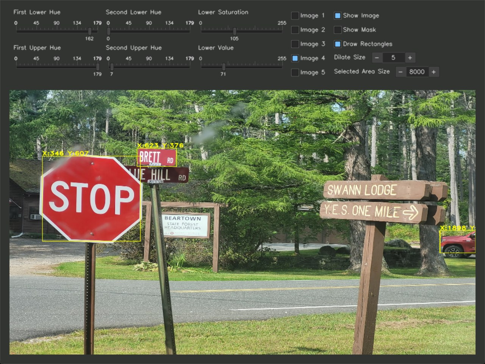

### **Object Detection by Color**

This application performs basic object detection based on color using **OpenCV**, **cvui**, and **NumPy**.

---

### **How to Install and Run**

You have a couple of options to get the app running:

1.  **Compile from source:** Install the necessary Python packages using `pip`:
    ```bash
    pip install opencv-python cvui numpy
    ```
2.  **Windows executable:** Download the pre-compiled executable file from the [releases page](https://github.com/bedylmz/objectDetect/releases).

---

### **Important Notes**

* **File Structure:** Do not change the names of the image files or the folder they are in. Altering the file structure may cause a fatal error.
* **Pixel Center:** The center pixel displayed in the app is based on the original image's dimensions, not the scaled version shown in the window.

---

### **App Usage**



The app interface allows you to select a target color, and it will then identify and highlight objects of that color in the image.

---

### **Screenshots**





